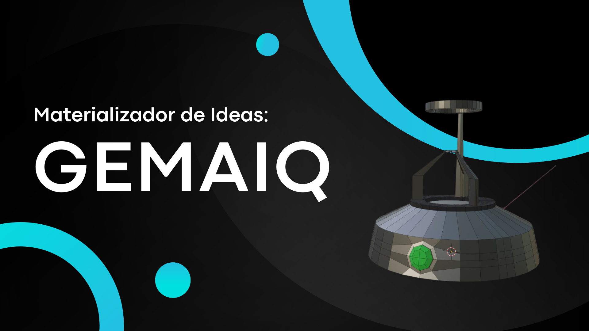
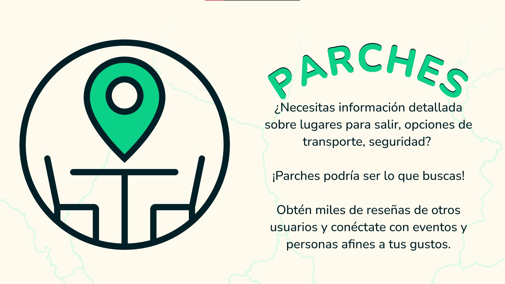
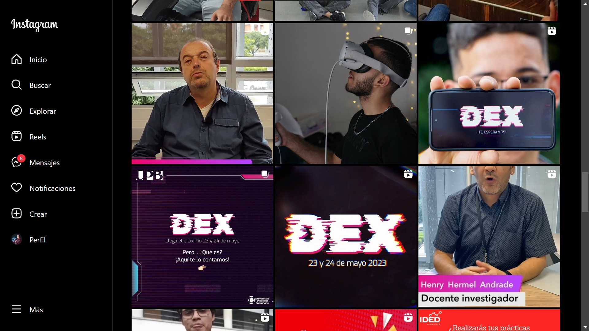

<h1 align="center">Hello There 👋, Soy Nicolás Villa Vargas</h1>
<h3 align="center">Ingeniero en Diseño de Entretenimiento Digital, Fotográfo y Diseñador Narrativo",</h3>

Estoy estudiando mi último semestre de Ingeniería en Diseño de Entretenimiento Digital con énfasis desarrrollo de videojuegos, VR/AR, UX/UI, fotografía, producción audiovisual, y narrativas transmedia.

<h3 align="left">Herramientas qué más uso:</h3>

       

# Proyectos en los que he participado
¡Dale click en as imagenes para saber más!

## Noctanbus VR

Escape Room en Realidad Virtual, para las Oculus Quest 2, desarrollado en colaboración con los chicos de Diseño Grafico como uno de sus entregables de la Materia Taller 5.

## Ancestor's Legacy

Juego del género Bullet Heaven, realizado durante la Global Game Jam 2023, en el que recorres las raices de la historia de la humanidad al tiempo qué vas heredando los poderes de tus ancestros para poderte enfrentar cada vez a más enemigos.

## Las Matas que Matan

Juego PvP local de peleas, con mécanicas de riesgo/recompensa, donde gracias a la extinción de la humanidad, las plantas que se han desarrollado por encima de lo que conocemos teniendo que adaptarse a lo poco que queda, sin darse el lujo de compartir ni un solo nutriente.

## GemaIQ

Prototipo de app movil que por medio de realidad aumentada escanea una piedra preciosa ubicada un "Materializador de ideas" y proyecta holográficamente la idea que tengas que pienses, así como una infografía y datos del funcionamiento del artefacto en si."

## Shedding Shadows

Proyecto Transmedia original y prototipado de un juego de plataformas para empatizar a los jóvenes sobre las dificultades de vivir con depresión y desmitificar la salud mental.

##Parches

Proyecto UX/UI de una App móvil que permite a los jóvenes conocer la agenda cultural y gastronómica de la ciudad de Medellín, suministrando la información necesaria para planear y ejecutar de manera exitosa sus parches (reuniones).

##DEX

Campaña dirigida y grabada para promocionar las muestras finales del pregado, DEX, en el instagram @somosided. 
Así mismo planeamos, coordinamos y gestionamos todo el evento y la logística de las muestras en campus universitario.

<h3 align="left">Formas de contactarme:</h3>

  

&nbsp;

  

